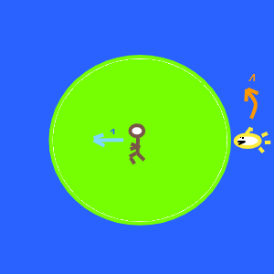

# shark-chase (continued)
Puzzle: Can you get to the beach before the shark gets there? 

## Puzzle

* You are on a circular island.
* There is a smart hungery shark that can swim 4 times faster than you can run. 
* You can see his position (and he can see yours).

Can you get to the beach before he gets there?
You're lazy. What's the shortest distance you need to run to get there?

# Naive Solution

You can't run from the center to the edge faster than the shark, but you can get to almost 1/4 of the distance, and still circle faster than the shark (your radius is smaller so the arc of your path is less than 1/4th his arc length).

Do that, then circle until you are opposite, then run the 3/4 radius to the beach.

3/4 < &pi;/4 !

## Questions

Ok, that works. But is it efficient?

# Degenerate solutions

## Stalemate

If you run straight away, the shark has an equal distance to your eventual location in either direction. Suppose it can't make up it's mind and just stays still?

## Stagger step

Suppose you zig-zag away from the shark such that he keeps reversing his direction? In theory you'll keep him too far away.

# Computed solutions

The [next step](READEME3.md) is an approximation methods.

