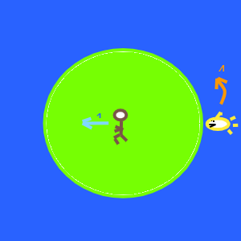

# shark-chase (calculated)
Puzzle: Can you get to the beach before the shark gets there? 

## Puzzle

* You are on a circular island.
* There is a smart hungery shark that can swim 4 times faster than you can run. 
* You can see his position (and he can see yours).

Can you get to the beach before he gets there?
You're lazy. What's the shortest distance you need to run to get there?

# Calculated Solution

## Theoretic

This is a problem what in theory should be solvable with *Variational Calculus*. The constraint that the shark can swim up to 4 times your speed, but reverse direction if optimal makes the actual equation hard to pose and hard to solve.

## Calculated Optimization

Let's have the man move in small descrete distances to the beach, changing his angle, and let the shark make the optimal move for each of those steps (lowering the difference in angle from the center, up to the maximum speed). We'll then use random variation to converge on an optimal path.

### Start
* _Shark_ on edge (arbitrary position &pi; angle)
* _Man_ in center starts in direction opposite shark; 

### Steps

* _Man_ moves in increment in radius each step
* _Man_ changes (maybe) angle each step
* _Shark_ moves to decrease difference in angle each step
* _Shark can move up to 4 times the distance the _Man_ moved

### Goal
* Minumum distance run without being eaten

### Penalty
* Optimizing the minimum distance alone is not sufficient 
   * You could have lost the race
   * It isn't easy to exclude all losing paths
   * We'll increase the cost of losing to exclude losing solutions
* To find a satisfactory penalty for losing
   * We want it to be large
   * We want it to be worse for losing earlier
* Penalty
   * Beyond 1/4 radius, the shark can't be at the same angle as you
   * We'll add a multiple of the total distance the shark is lying in wait to the penalty
   * Add even more if he's there at the end

### 

### Code design

### Run it
