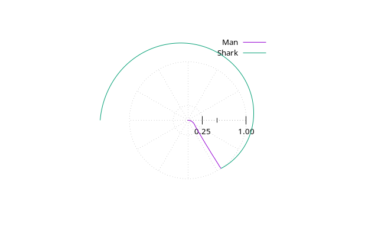

# shark-chase (results)
Puzzle: Can you get to the beach before the shark gets there? 

## Puzzle

* You are on a circular island.
* There is a smart hungry shark that can swim 4 times faster than you can run. 
* You can see his position (and he can see yours).

Can you get to the beach before he gets there?
You're lazy. What's the shortest distance you need to run to get there?

# 1000 points

    paulalfille@penguin:~/shark$ gcc -o shark shark.c -lgsl -lm
    paulalfille@penguin:~/shark$ ./shark 
    Data points: 1000
    Calculation with 1000 points:
        -55.496845      Total angle turned by man (degrees)
        -235.495736     Total angle turned by shark (degrees)
        1.027544        Total length of man's run
        0.000000        penalty for shark bite

# Graphically

------------
### Table of Contents
[Puzzle posed](README.md)
[Naive solution](README2.md)
[Computing strategy](README3.md)
[The program](README4.md) <- NEXT
[Solution results](README5.md)
-----------
by Paul H Alfille 2025
[on Github](https://github.com/alfille/shark-chase)
