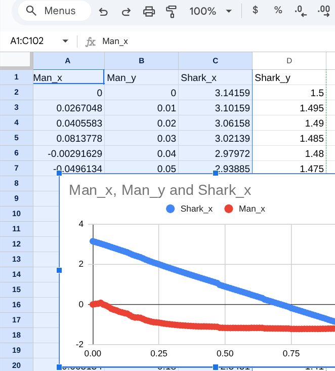

# CSV file

CSV is __comma separated values__
A very simple format for data exchange. Especially useful for importing to spreadsheets, and plotting programs.



## dat2csv.py

* Python program
* run with:

        python3 dat2csv.py

* converts output of a simulation run to a csv (Comma Separated Values) file
* put _dat_ file on command line, or a file picker will pop up.
* output is same filename with __.csv__ extension.
* Example:
```
$ head data100.dat
Man
0 0
0.0267048 0.01
0.0405583 0.02
0.0813778 0.03
-0.00291629 0.04
-0.0496134 0.05
-0.118152 0.06
-0.212343 0.07
-0.260068 0.08

$ python3 dat2csv.py data100.dat 

$ head data100.csv
"Man_x","Man_y","Shark_x","Shark_y"
0,0,3.14159,1.5
0.0267048,0.01,3.10159,1.495
0.0405583,0.02,3.06158,1.49
0.0813778,0.03,3.02139,1.485
-0.00291629,0.04,2.97972,1.48
-0.0496134,0.05,2.93885,1.475
-0.118152,0.06,2.89613,1.47
-0.212343,0.07,2.84927,1.465
-0.260068,0.08,2.8068,1.46
```