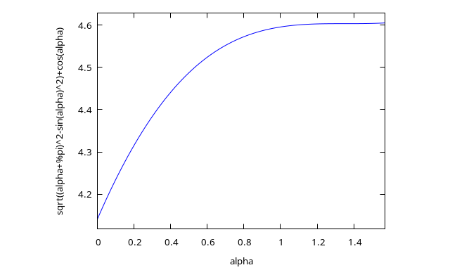

# Play The Angles
## How about changing the path to the shore?

Building on the [previous work](./circle.md)

In this case we go to distance \\(r=1/v\\), rotate to escape the shark, then aim farther away than straight from the center. Is it faster?

* Shark
  * Distance along shore: \\(\alpha+\pi\\) radians
    * \\(\pi\\) radians to straight path (analyzed above)
    * \\(\alpha\\) radian further for angled path
  * Time for shark to travel full distance: \\((\alpha+\pi)/v\\)
* Man
  * Distance to that point: \\(d = \sqrt{1 + r\^2 - 2 r cos( \alpha )}\\) (law of cosines)
  * Time for the man: \\(d\\)
* Both travel exactly that distance in same amount of time: \\( d=(\alpha+\pi)/v\\)    
\\[d=\frac{\alpha+\pi}{v}\\]
\\[d\^2=\frac{{(\alpha+\pi)}\^2}{v\^2}\\]
* Law of cosines
\\[d\^2=r\^2+1-2r\\,cos(\alpha)\\]
* Substitute for \\(d\^2\\):
\\[\frac{{(\alpha+\pi)}\^2}{v\^2}=r^2+1-2r\\,cos(\alpha)\\]
* Use \\(r=1/v\\)
\\[\frac{{(\alpha+\pi)}\^2}{v\^2}=\frac{1}{v^2}+1-\frac{2\\,cos(\alpha)}{v}\\]
\\[{(\alpha+\pi)}\^2=1+v\^2-2v\\,cos(\alpha)\\]
* Solve for \\(v\\):
\\[v=cos(\alpha)+\sqrt{{(\alpha+\pi)}\^2-{sin(\alpha)}\^2}\\]
* Graphically:

\\[v\lt\sqrt{(3\pi/2)^2-1}\approx 4.605\\]
* Problems

The problem with this solution is that it assumes the shark will take the long path. We can view it as a limiting case.

