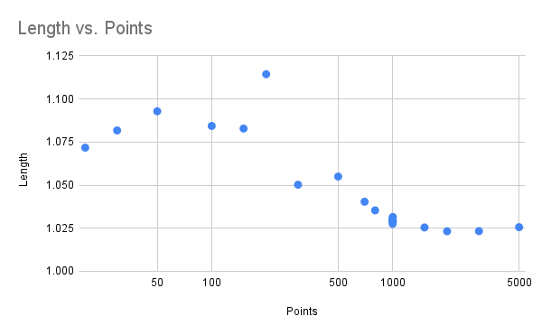
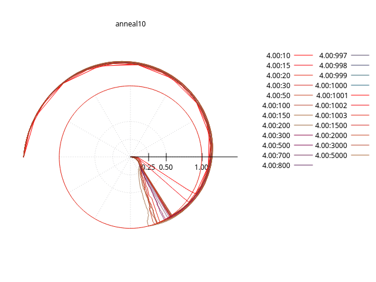
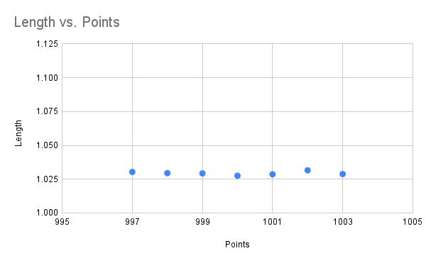
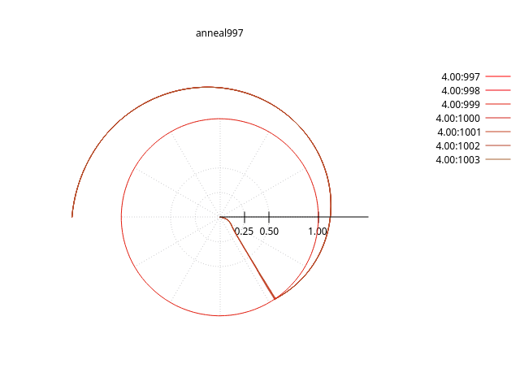

# Vary resolution

The annealing algorithm is relatively slow, requiring many calculations at each slowly decreasing temperature. We can control how many segments are chosen between the center and shore.

## Segments vs solution result:

Note that the numver of segments is shown on a logrithmic scale.

Clearly around 1000 points, the solution settles to a new final result.

Graphically this looks like:

In the region >= 1000 or so, there is very little noise:

## Randomness

We use the same random seed in each run. To see the effect of the seed, we could either vary it, or make small changes to change how the sequence is used.

### Slight variance of segment number:

Which shows this solution is relatively stable for these starting conditions and simulation parameters.

