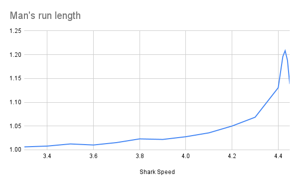
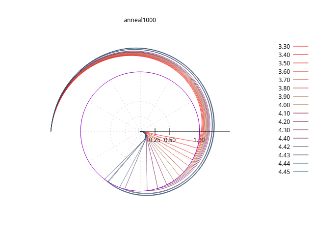

# Vary Speed

We know from [earlier analysis](./circle.md) that there are solutions to the puzzle for at least \\(Shark Speed = \pi+1 \approx 4.14\\)

## Anneal solution (1000 segments)

Faster than 4.4 the results are not consistent, but in general, faster sharks require a sharper angle sturn and more time.

## Relative speed

### Shark vs Man

|Speed	|Man	|Shark	|Ratio|
|--|--|--|--|
|3.3	|1.00615	|3.3203	|3.300004969|
|3.4	|1.00788	|3.4268	|3.400007937|
|3.5	|1.01235	|3.54323	|3.500004939|
|3.6	|1.01016	|3.63657	|3.59999406|
|3.7	|1.01522	|3.75631	|3.69999606|
|3.8	|1.023	|3.88741	|3.800009775|
|3.9	|1.02182	|3.9851	|3.900001957|
|4	|1.02754	|4.11017	|4.000009732|
|4.1	|1.0357	|4.24634	|4.099971034|
|4.2	|1.04999	|4.40994	|4.199982857|
|4.3	|1.06851	|4.59459	|4.299997192|
|4.4	|1.1305	|4.97417	|4.399973463|
|4.42	|1.19601	|5.286315	|4.419958863|
|4.43	|1.20836	|5.35299	|4.429962925|
|4.44	|1.18818	|5.27547	|4.439958592|
|4.45	|1.138301	|5.06542	|4.449982913|

Clearly the Shark is running at max allowable speed relative to the Man's speed.

 