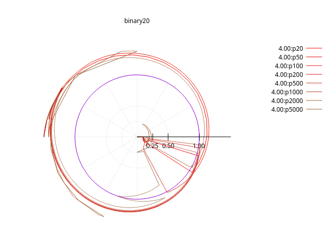
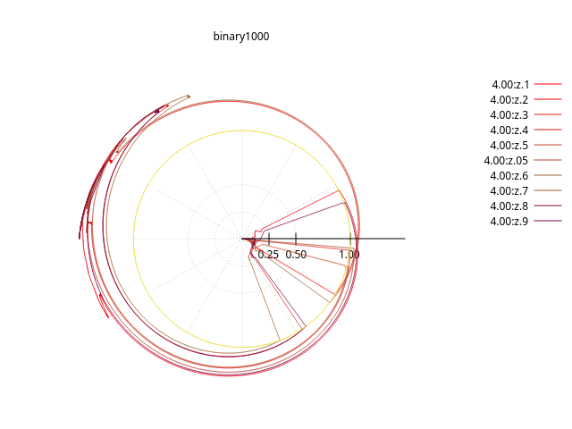
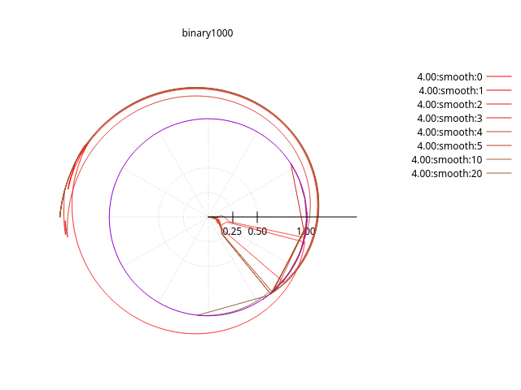
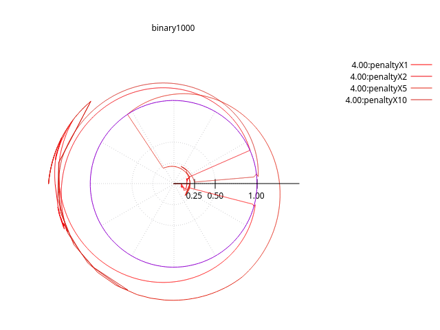
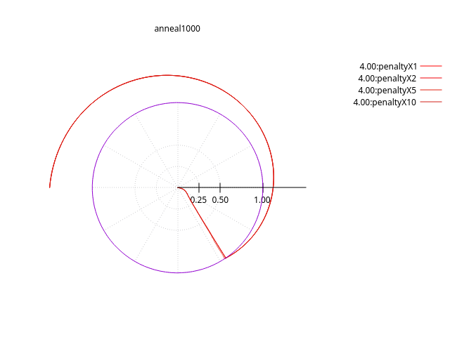

# Vary Resolution

## Number of segments

Unlike the [simulated annealing][./aresolution.md) algorithm, the binry algorithm is sensitive to initial many factors.

## Rate of descent

Technically a __binary__ search will decrease the purtubation in half each step. That .5 factor can be varied:

But the result is no smoother

## Smoothing

In theory, smoothing should give a less jagged contour.

In these cases, it seems that the abrupt changes are seen at start and end, not just start.

## Penalty Weighting

Should have no bearing if a solution is findable, but test:

In contrast, the Simulated Annealling is insensitive to the penalty multiple:

