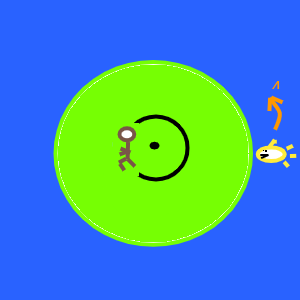

# Small Circle Solution

## Angular velocity

The shark can change angle (in radians)

\\[\dot\theta\_{shark}=4\\]

The man at constant radius \\(r\\) has angular speed

\\[\dot\theta\_{man}=\\frac{1}{r}\\]

So for \\(r\lt\frac{1}{4}\\) the man can circle faster than the shark.

## Solution

* Man runs to almost \\(r=\frac{1}{4}\\)
  * distance to shore \\(1-\frac{1}{4}\\)
  * time to shore \\(1-\frac{1}{4}\\)
* Circles at that distance until shark is \\({\pi}\\) radian away (opposite side).
  * shark can swim that distance in \\(\frac{\pi}{4}\\) units time
* Run straight to shore!

\\[1-\frac{1}{4} \lt\ \frac{\pi}{4} \\quad\text{i.e.}\\quad 0.750 \lt 0.785\\]

## Other speeds

More generally, if the shark speed it \\(v\\) and the man runs to \\(\frac{1}{v}\\) the same strategy requires:

\\[1-\frac{1}{v}\lt\frac\{\pi}{v}\\]

\\[v\lt\pi+1\approx 4.142\\]

## Optimization

The strategy works, but is it the most efficient?
