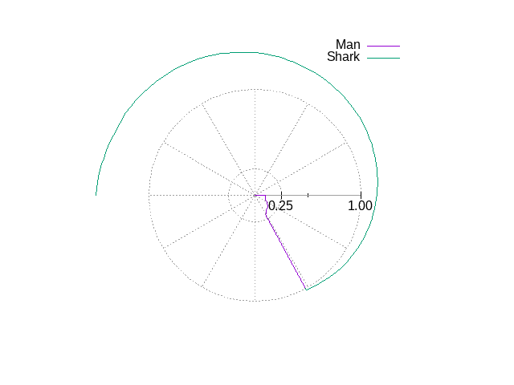
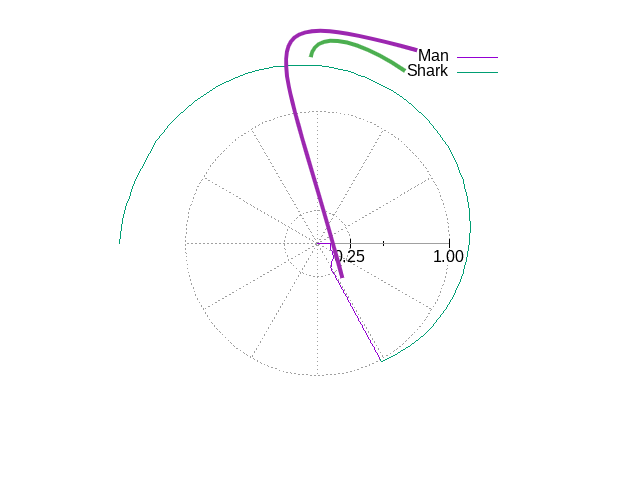
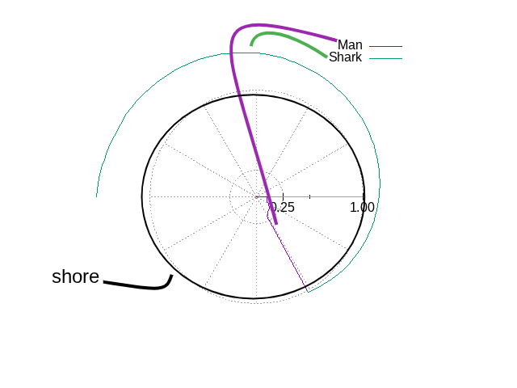

# Display

## Gnuplot output

The simulation programs generate:

* A brief summary output to the terminal
* File of distance and angles for man and shark
  * radians and distance
  * Simple format for __gnuplot__
  * can be converted to CSV format by [dat2csv.py](./CSV_file.md)
* A __gnuplot__ script file to generate display
* Display
  * In a graphical window (default)
  * Directly to a PNG file with "-o" option

-------------
## Man and Shark Path

* The man starts at the center and travels to the shore
* The Shark just circles the perimeter

__Note that the shark is shown spiraling in__

* This is an artificial display feature to make it easier to see any reversals.
* The actual calculation has the shark traveling along the shore

------------
## Shore

This should make the shore more obvious.