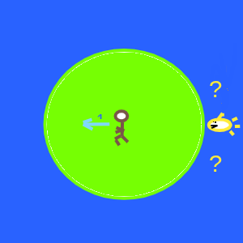

# Indecision

## Trivial solution

If you run straight away from the shark, an indecisive shark may not be able to choose clockwise or counterclockwise around the island -- they are equally good choices.

## Escape

You get to the beach while the shark is still trying to decide the best direction.

## Rejected

Sharks are never indecisive. We'll disallow this solution.
