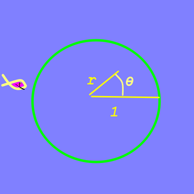
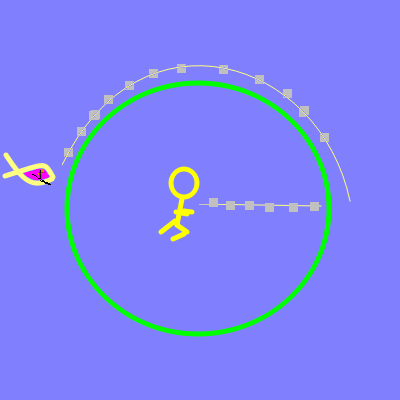

# Numerical Approach

## Coordinates

Model the island world as a circle of radius \\(1\\). Use polar coordinates.

* Man position \\( (\\,r,\\,\theta\_M) \\)
  * \\( 0\le r\le 1\\)
* Shark at \\( (\\,1,\\,\theta\_S ) \\)

## Descrete

* Man
  * Partition the \\(r\\) journey into \\(N\\) segments
  * At each point, the \\(r\\) coordinate is known
  * The angle \\(\theta\_M\\) can be varied
* Shark
  * For each segment, compute the shark's new position
    * radius always \\(1\\)
    * distance \\( \Delta{\theta\_S} \\) constrained by maximum speed
    * direction to minimize angle difference

## Strategy

* Technique
  * Vary \\(\theta\_M\\) for each segment
  * Compute total path length \\( L=\sum\_{i=1}\^N{r\_i\^2+r\_{i-1}\^2-2\\,r\_i\\,r\_{i-1}\\,cos(\theta\_i-\theta\_{i-1})}\\) [Law of Cosines](https://en.wikipedia.org/wiki/Law_of_cosines)
* Goal
  * Minimize \\(L\\)
  * Make sure that \\( \theta\_S[final]  \ne  \theta\_M[final] \\) (Not eaten!)
