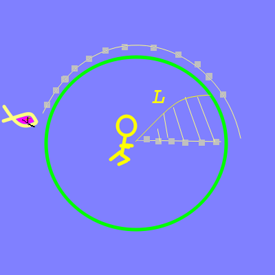

# Simulated Annealing

[Simulated Annealing](https://en.wikipedia.org/wiki/Simulated_annealing) is a numerical technique for finding a global optimum. I borrows the idea from mettalurgy that slowly decreasing temperature let's non-optimal pertubations that stay withing the kinetic bounds. In theory, it prevents premature decent to a local optimum by letting some global exploration happen.

## Library

We use the [Gnu Scientific Library (GSL)](https://www.gnu.org/software/gsl/doc/html/siman.html) implementation, pretty much straight from the example code (adjusted for the current problem).

GSL is also used for random number algorithms

## Code

### Program

* The program name is __shark_anneal__
* Code written in C
* Resides in subdirectory __anneal__

### Prerequisites:

```
apt install git build-essential libgsl-dev
```

### Install

Installed with the repository:
```
git clone https://github.com/alfille/shark-chaser
cd shark-chaser
make
```

## High-level process



### Start

* Array of equally spaced radial segments
  * Concentrated in center if "-c" option specified
* Angles for each segment endpoint all 0

### Step

* segment endpoint chosen at random and varied random amount (limited by algorithm)
  * called "Step" in annealing
* new length and penalty computed (requires computing shark position)
  * called "Energy" in annealing lexicon.
* shark position chosen to maximum speed in direction of man
* Acceptance of change depends on annealing algorithm

### Goal

* Minimum length + penalty
* Penalty for shark finishing at same point on shore
* Add small penalty for each step shark and man at same angle (after leaving 1/v center).

## Output

```
$ ./shark_anneal 
Data points: 100
        calculating -- may take a while
Calculation with 100 points:
        -68.518664      Total angle turned by man (degrees)
        -248.517772     Total angle turned by shark (degrees)
        1.084363        Total length of man's run
        0.000000        penalty for shark bite
```

Along with some [files](./files.md) and a graph


## Options
```
$ ./shark_anneal -h
shark-chase
        find fastest way to beach avoiding shark
        by Paul H Alfille 2023 -- MIT Licence
        See https://github.com/alfille/shark-chase

shark [options]

Options
        -p100   --path          number of steps (default 100)
        -s4     --speed         Shark speed (default 4)
        -atext  --add           Add text to end of control and data file names
        -c      --center        Concentrate points in the center (1/v central radius
        -v      --verbose       show progress during search
        -o      --output        Save to file in format anneal*.png
        -h      --help          this help

Obscure options
        -x1     --penalty       Penalty multiplier (default 1)  -n10000 --ntries        Points before stepping (default 10000)
        -i10000 --iterations    Iterations at each temperature (default 10000)
        -m1     --multiplier    Multiplier for pertubation (default 1)
        -K1     --boltzman      Boltzman constant (default 1)
        -u1.003 --mu            Temperature damping factor (default 1.003)
        -t0.008 --temperature   Initial temperature (default 0.008)
        -z2e-06 --final         Final temperature (default 2e-06)
```

* -p -s are the most interesting changes
* for running a number of simulations with different parameters, the -o option will avoid opening many grapgics windows
* the *Obscure options* are for changing the internals of the Annealing algorithm. See the [GSL documentation](https://www.gnu.org/software/gsl/doc/html/siman.html) for an explanation 

