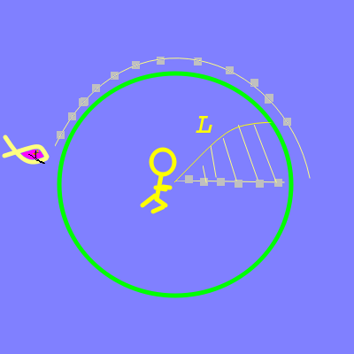
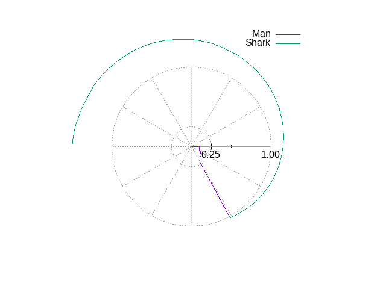

# Binary Search

Simple home-grown algorithm:

* 1.Start with a step size
  * 2.Test perturbing each angle by that step
    * Choose best pertubation
    * Go to 2
    * If Best pertubation is none:
      * Halve step size
      * Go to 1
    * Stop when step size below some threshold

## Library

Straight C with C math lib

## Code

### Program

* The program name is __shark-binary__
* Code written in C
* Resides in subdirectory __binary__

### Prerequisites:

```
apt install git build-essential libgsl-dev
```

### Install

Installed with the repository:
```
git clone https://github.com/alfille/shark-chaser
cd shark-chaser
make
```

## High-level process



### Start

* Array of equally spaced radial segments
  * Concentrated in center if "-c" option specified
* Angles for each segment endpoint all 0

### Step

For a given step size:

* Compute length+penalty of index case
* Test perturbing each angle in turn with + or - step
* If length+penalty always worse that index, cut step in half and try again
* Else choose best perturb as index and try again

### Goal

* Minimum length + penalty
* Penalty for shark finishing at same point on shore
* Add small penalty for each step shark and man at same angle (after leaving 1/v center).

## Output

```
$ ./shark_binary 
Data points: 100
        calculating -- may take a while
0 -> 1 
 SMOOTH = 0
Calculation with 100 points:
        -61.592351      Total angle turned by man (degrees)
        -241.592351     Total angle turned by shark (degrees)
        1.083993        Total length of man's run
        0.000000        penalty for shark bite
```

Along with some [files](./files.md) and a graph


## Options
```
$ ./shark_binary -h
shark-chase
        find fastest way to beach avoiding shark
        by Paul H Alfille 2023 -- MIT Licence
        See https://github.com/alfille/shark-chase

shark [options]

Options
        -p100   --path          number of steps (default 100)
        -s4     --speed         Shark speed (default 4)
        -atext  --add           Add text to end of control and data file names
        -c      --center        Concentrate points in the center (1/v central radius
        -m0     --smooth        Number of side elements to add to smoothing (default 0)
        -v      --verbose       show progress during search
        -o      --output        Save to file in format binary*.png
        -h      --help          this help

Obscure options
        -x1     --penalty       Penalty multiplier (default 1)
        -g25    --generations   Number of halving error delta (default (25)
```

* -p -s are the most interesting changes
* for running a number of simulations with different parameters, the -o option will avoid opening many grapgics windows
* the *Obscure options* are for changing the internals of the Annealing algorithm. See the [GSL documentation](https://www.gnu.org/software/gsl/doc/html/siman.html) for an explanation 

