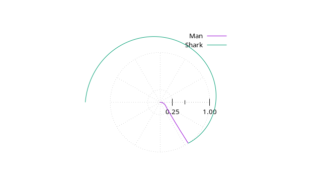

# Simplification

We know from the [previous section](theory.md) that we need to minimize:

\\[L\_M=\int\_0\^{t\_{final}}v\_M\\,dt\\]

The given constraints are difficult, so let make some simplifying assuptions:

## The shark moves with constant maximum speed

\\[v\_S=\dot\theta\_S=V\_{max}\quad\rightarrow\\quad\theta\_S=V\_{max}\times t - \pi\\]

## The man moves at constant maximum speed

\\[v\_M=1\quad\rightarrow\quad L\_M=t\_{final}\\]

\\[{\dot r\_M}^2+{r\_M}\^2\\,{\dot\theta\_M}\^2 = 1\\]   

## The man never circles fast enough to reverse the shark

Relaxed constraint

\\[\theta\_S+\pi\ge\theta\_M\ge\theta\_S\\]
\\[\rightarrow-\pi/2\le\theta\_M-\theta\_S-\pi/2\le\pi/2\\]
\\[\rightarrow\lvert\theta\_M-\theta\_S-\pi/2\rvert\le\pi/2\\]

With the equation for \\(\theta\_S\\):

\\[\rightarrow\lvert\theta\_M-V\_{max}\times t +\pi/2\rvert\le\pi/2\\]

