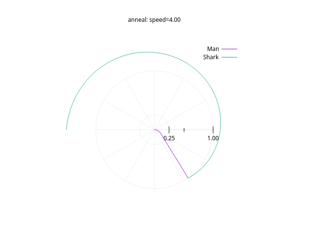

# Simulated Annealing Solutions

We'll explore numerical solutions to the __Shark Puzzle__ using:

* Different algorithms
* Varried resolution
* Varried speed

----

## TL;DR

Solution for 5000 segments, speed 4, Simulated Annealing:

```
Calculation with 5000 points:
        -55.051467      Total angle turned by man (degrees)
        -235.050864     Total angle turned by shark (degrees)
        1.025603        Total length of man's run
        0.000000        penalty for shark bite
```



[Explanation here](./display.md)

```
Series: Man
        Data points: 5001
        Column 1 range -0.960835 to 0.00180933
        Column 2 range 0.0 to 1.0
        Path length 1.025603234846971
Series: Shark
        Data points: 5001
        Column 1 range -0.960819 to 3.14159
        Column 2 range 1.0 to 1.0
        Path length 4.102408884147815
Compare speed
        Man: Man
        Shark: Shark
        Speed:
                max 4.0489293758979
                min 3.9519493162784376
                avg 3.9999960459952435
```