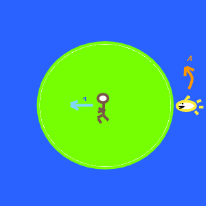

# Theoretical Solution

## Man

### Position

* radius: \\(r(t)\\)
  * start: \\(r\_M(0)=0\\)
* angle: \\(\theta\_M(t)\\)
  * start \\(\theta\_M(0)=0\\)
* speed: \\(v\_M=\sqrt{{\dot r(t)}\^2+r(t)\^2\times{\dot\theta\_M(t)}\^2}\\)

## Shark

* radius: 1 (the shore).
* angle \\(\theta\_S(t)\\)
  * start: \\(\theta\_S(0)=-\pi\\)
* speed: \\(v\_S=\dot\theta\_S(t)\\)
* Constraints:
  * Speed constraint: \\(\lvert v\_S\rvert=\lvert\dot{\theta\_S}\rvert\le V\_{max}\times \lvert v\_M\rvert\\)
    * where \\(V\_{max}\\) is how much faster the shark is than the man
  * Direction constraint:
    * Shark changes direction to shorter path around the island   
\\[ \dot\theta\_S \gt 0\quad\text{if}\quad(\theta\_M-\theta\_S)\\,mod\\,\(2\pi)\lt\pi\\]
\\[ \dot\theta\_S \lt 0\quad\text{if}\quad(\theta\_M-\theta\_S)\\,mod\\,\(2\pi)\gt\pi\\]

## Endpoint

At \\(t=t\_{final}\\)

* \\(r(t\_{final})=1\quad\\) __Shore__
* \\(\theta\_M(t\_{final})=\theta\_{final}\quad\\) __Spot on shore__
* \\(\theta\_S(t\_{final})\ne\theta\_{final}\quad\\) __Shark ain't there__

## Goal

Minimize length travelled:

\\[L\_M=\int\_0\^{t\_{final}}v\_M\\,dt\\]
\\[\rightarrow\\quad L\_M=\int\_0\^{t\_{final}}\sqrt{{\dot r(t)}\^2+r(t)\^2\times{\dot\theta\_M(t)}\^2}\\,dt\\]
\\[\rightarrow\\quad L\_M=\int\_0\^{\theta\_{final}}\sqrt{r(\alpha)\^2+\lbrace\frac{d r(\alpha)}{d \alpha}\rbrace\^2}\\,d\alpha\\]

## Approach

This is a classic minimization problem for find the optimal function \\(r(\theta)\\) which should be solvable using the [Calculus of Variations](https://en.wikipedia.org/wiki/Calculus_of_variations)

## Difficulties
 
* The constraints are inequalities and wrap around the circle.