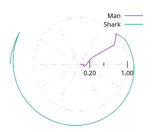

# ZigZag

## Weave and dodge

If you change direction while you are still close to the center, you can force the shark to change direction, too. 

## Questions

While the solution works theoretically, it's not clear if you can physically change directions fast enough to fool the shark. In otherwords, this assumes you can change directions instantaneously which migfht not be physically realistic. 

Can zigzag work with a continuously differentiable function?